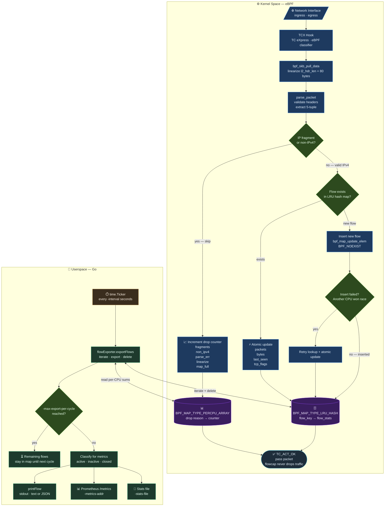

# Architecture



## Flow Storage

Flow information is stored **in kernel memory** using an eBPF hash map:

- **Location:** Kernel space (RAM only, no disk persistence), shared between eBPF program (kernel) and Go program (userspace)
- **Map type:** `BPF_MAP_TYPE_LRU_HASH` - when the map is full, kernel automatically evicts the least recently used flow
- **Capacity:** Maximum 262,144 concurrent flows (configurable, default 16,384)

**Data structure:**

```c
Key: flow_key {
    src_ip, dst_ip      // IPv4 addresses
    src_port, dst_port  // TCP/UDP ports
    protocol            // TCP=6, UDP=17, etc.
}

Value: flow_stats {
    packets             // Packet count (64-bit)
    bytes               // Byte count (64-bit)
    first_seen          // Timestamp (nanoseconds)
    last_seen           // Timestamp (nanoseconds)
    tcp_flags           // TCP flags (SYN, FIN, RST, etc.)
}
```

**Lifecycle:**

1. **Packet arrives** - eBPF program updates flow counters in kernel map
2. **Every interval** (default 10s) - Go program reads map and:
   - **Active flows**: Export and delete; new packets recreate the flow with fresh timestamps
   - **Inactive flows** (no packets for `timeout` seconds): Export and delete
   - **TCP closed** (FIN/RST flags): Export and delete

   > **Note:** All flows are exported and deleted every interval regardless of their state. This is intentional — each exported record represents a fixed time window (e.g. 10s), so `bytes / duration` gives accurate throughput for that window. Long-lived connections produce multiple records over time, providing real-time visibility into bandwidth usage. This is equivalent to NetFlow's active timeout behavior. An alternative approach (export only inactive/closed flows, keep active flows accumulating) would lose per-interval throughput visibility and produce unbounded counters with no time context.

3. **Map full** - LRU automatically evicts least recently used flows
4. **Rate limiting** - Configurable maximum flows exported per cycle (default 10,000) to prevent log flooding

## eBPF Program (`flowcap.c`)

The eBPF program runs in kernel space and is attached to the TC (Traffic Control) layer via TCX hook on both ingress and egress. It is compiled to BPF bytecode by clang and loaded into the kernel by the Go program at startup.

**Per-packet processing (`flow_capture`):**

1. Calls `bpf_skb_pull_data(skb, l2_hdr_len + 80)` to linearize headers into contiguous memory. `l2_hdr_len` is a load-time constant set by the Go loader based on interface type: 14 (`ETH_HLEN`) for Ethernet (total 94 bytes) and 0 for L3 TUN/WireGuard (total 80 bytes). The 80 bytes cover worst-case IP header (60 bytes with options) plus TCP header (20 bytes).

   > **Why this is needed:** The kernel stores a packet (`skb`) in two parts: *linear data* — a contiguous buffer accessible via `skb->data` to `skb->data_end` — and *paged data* — the rest of the packet scattered across memory pages, not directly accessible to eBPF. Normally headers land in the linear part, but with GRO (Generic Receive Offload, where the kernel merges many packets into one large buffer) or certain NIC drivers, the linear part can be very small — sometimes only the Ethernet + IP header fits, and the TCP/UDP header ends up in paged data. The eBPF program can only see the linear part, so the bounds check `(void *)(tcp + 1) > data_end` fails because `data_end` ends before the TCP header — causing `DROP_PARSE_ERR`. `bpf_skb_pull_data` tells the kernel to pull the required bytes into the linear part, guaranteeing that L2 (if present), IP, and TCP/UDP headers are in contiguous memory before any pointer dereference. If linearization fails, the packet is passed through and a `DROP_LINEARIZE` counter is incremented.
2. Calls `parse_packet` to validate and extract flow information from the raw packet; if parsing fails, increments the appropriate drop counter (fragments, non-IPv4, or parse error) and passes the packet through
3. Looks up the flow key in the LRU hash map
4. If the flow exists — atomically increments packet count and byte count, overwrites last-seen timestamp, and OR-accumulates TCP flags
5. If the flow does not exist — inserts a new entry with `BPF_NOEXIST`; if another CPU created the same flow between the lookup and insert (race condition), retries the lookup and updates the existing entry; if the retry lookup also fails (map full, LRU eviction race), increments `DROP_MAP_FULL`
6. Always returns `TC_ACT_OK` — the packet is never dropped, only observed (including when linearization fails)

**Packet parsing (`parse_packet`):**

- Operates on linearized skb data (headers guaranteed contiguous by `bpf_skb_pull_data` in `flow_capture`)
- Supports both L2 (Ethernet) and L3 (TUN/WireGuard) interfaces: uses `skb->protocol` for protocol detection and a load-time constant `l2_hdr_len` to locate the IP header (14 bytes past `data` on Ethernet, 0 on L3 TUN)
- Validates all pointer bounds before memory access (required by the eBPF verifier)
- Accepts IPv4 only; non-IPv4 packets return a `DROP_NON_IPV4` code
- Skips all fragmented IP packets (MF flag or fragment offset > 0), returning `DROP_FRAGMENTS` — subsequent fragments do not carry TCP/UDP port headers and cannot be matched to a flow
- Extracts the 5-tuple: src/dst IP, src/dst port, protocol
- For TCP: extracts raw flags byte from offset 13 of the TCP header
- For UDP: extracts ports; flags are set to `0x00` (UDP has no flags)
- For other protocols: ports are set to `0`; the protocol number is still recorded in the flow key (e.g. ICMP=1, IGMP=2, GRE=47, ESP=50)

**Memory characteristics:**

- Fast hash map lookups in kernel (`O(1)`)
- No disk I/O during packet processing
- Data lost on program restart (in-memory only)
- Approximately 100 bytes per flow entry

## Drop Counters

A separate `BPF_MAP_TYPE_PERCPU_ARRAY` map tracks packets that were skipped during parsing. Each CPU maintains its own counter (no contention), and the Go program sums them per export cycle. Five drop reasons are tracked:

| Index | Reason        | Description                                          |
|-------|---------------|------------------------------------------------------|
| 0     | `fragments`   | IP fragmented packets (MF flag or fragment offset > 0) |
| 1     | `non_ipv4`    | Non-IPv4 packets (IPv6, ARP, etc.)                   |
| 2     | `parse_error` | Packets with invalid/truncated headers (after linearization) |
| 3     | `linearize`   | `bpf_skb_pull_data` failed to linearize packet headers |
| 4     | `map_full`    | Flow map insert failed and retry lookup also failed (LRU eviction race) |
