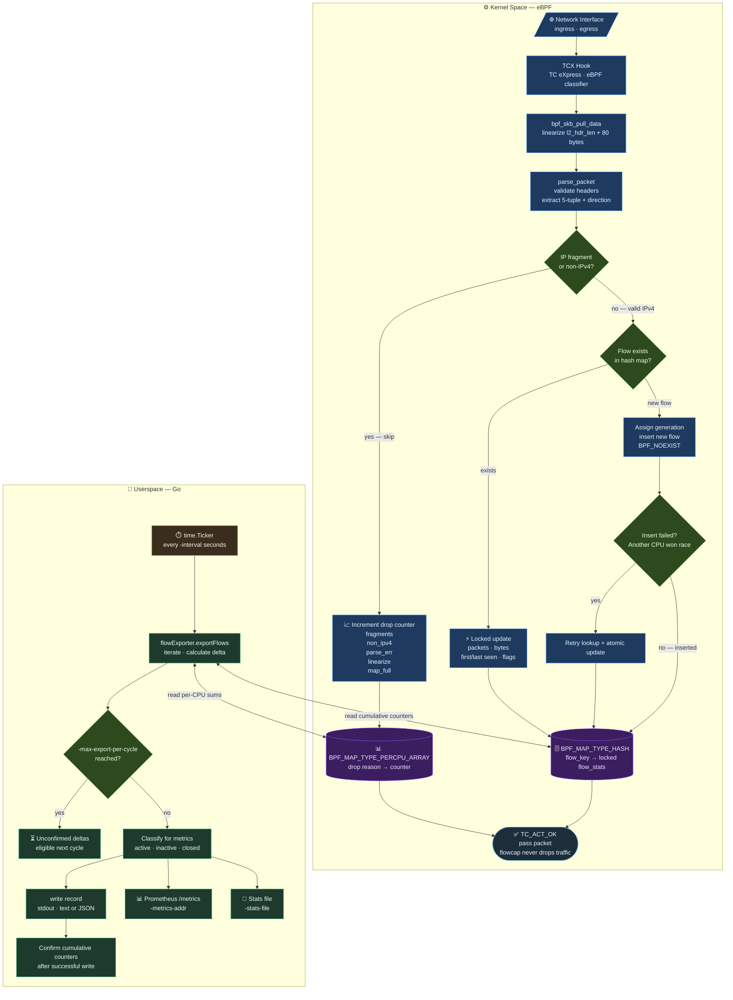

# Architecture


```mermaid
flowchart TD
    subgraph KERNEL["⚙️ Kernel Space — eBPF"]
        NIC[/"🌐 Network Interface<br/>ingress · egress"/]
        TC["TCX Hook<br/>TC eXpress · eBPF classifier"]
        PULL["bpf_skb_pull_data<br/>linearize l2_hdr_len + 80 bytes"]
        PARSE["parse_packet<br/>validate headers<br/>extract 5-tuple + direction"]
        FRAG{IP fragment<br/>or non-IPv4?}
        DROPCNT["📈 Increment drop counter<br/>fragments<br/>non_ipv4<br/>parse_err<br/>linearize<br/>map_full"]
        LOOKUP{Flow exists<br/>in hash map?}
        UPDATE["⚡ Locked update<br/>packets · bytes<br/>first/last seen · flags"]
        INSERT["Assign generation<br/>insert new flow<br/>BPF_NOEXIST"]
        RACE{Insert failed?<br/>Another CPU won race}
        RETRY["Retry lookup + atomic update"]
        MAP[("🗄️ BPF_MAP_TYPE_HASH<br/>flow_key → locked flow_stats")]
        DROPMAP[("📊 BPF_MAP_TYPE_PERCPU_ARRAY<br/>drop reason → counter")]
        ACT(["✅ TC_ACT_OK<br/>pass packet<br/>flowcap never drops traffic"])
    end

    subgraph USERSPACE["🐹 Userspace — Go"]
        TICKER["⏱️ time.Ticker<br/>every -interval seconds"]
        EXPORT["flowExporter.exportFlows<br/>iterate · calculate delta"]
        RATELIMIT{"-max-export-per-cycle<br/>reached?"}
        REMAINING["⏳ Unconfirmed deltas<br/>eligible next cycle"]
        PRINT["write record<br/>stdout · text or JSON"]
        CONFIRM["Confirm cumulative counters<br/>after successful write"]
        CLASSIFY["Classify for metrics<br/>active · inactive · closed"]
        PROMETHEUS["📊 Prometheus /metrics<br/>-metrics-addr"]
        STATSFILE["📄 Stats file<br/>-stats-file"]
    end

    NIC --> TC --> PULL --> PARSE --> FRAG
    FRAG -->|yes — skip| DROPCNT --> DROPMAP --> ACT
    FRAG -->|no — valid IPv4| LOOKUP
    LOOKUP -->|exists| UPDATE --> MAP
    LOOKUP -->|new flow| INSERT --> RACE
    RACE -->|yes| RETRY --> MAP
    RACE -->|no — inserted| MAP
    MAP --> ACT

    TICKER --> EXPORT
    EXPORT <-->|read cumulative counters| MAP
    EXPORT <-->|read per-CPU sums| DROPMAP
    EXPORT --> RATELIMIT
    RATELIMIT -->|yes| REMAINING
    RATELIMIT -->|no| CLASSIFY --> PRINT --> CONFIRM
    CLASSIFY --> PROMETHEUS
    CLASSIFY --> STATSFILE

    classDef kernel fill:#1e3a5f,stroke:#4a9eff,color:#e8f4ff
    classDef decision fill:#2d4a1e,stroke:#6abf40,color:#e8ffe8
    classDef map fill:#3a1e5f,stroke:#9a4aff,color:#f0e8ff
    classDef output fill:#1e3a2d,stroke:#40bf8a,color:#e8fff4
    classDef action fill:#1e2d3a,stroke:#40a0bf,color:#e8f4ff
    classDef ticker fill:#3a2d1e,stroke:#bf8a40,color:#fff4e8

    class NIC,TC,PULL,PARSE,UPDATE,INSERT,RETRY kernel
    class FRAG,LOOKUP,RACE,RATELIMIT decision
    class MAP,DROPMAP map
    class DROPCNT kernel
    class ACT action
    class TICKER ticker
    class EXPORT,PRINT,CONFIRM,CLASSIFY,REMAINING output
    class PROMETHEUS,STATSFILE output
```

## Flow Storage

Flow information is stored **in kernel memory** using an eBPF hash map:

- **Location:** Kernel space (RAM only, no disk persistence), shared between eBPF program (kernel) and Go program (userspace)
- **Map type:** `BPF_MAP_TYPE_HASH` - existing entries remain stable; insertion fails visibly when capacity is exhausted
- **Capacity:** Maximum 262,144 flow instances retained until shutdown (configurable, default 16,384)

**Data structure:**

```c
Key: flow_key {
    src_ip, dst_ip      // IPv4 addresses
    src_port, dst_port  // TCP/UDP ports
    protocol            // TCP=6, UDP=17, etc.
    flow_direction      // ingress=0, egress=1 at the monitored interface
}

Value: flow_stats {
    lock                // synchronizes packet updates with userspace snapshots
    generation          // Flow-instance identifier (64-bit)
    packets             // Packet count (64-bit)
    bytes               // TC-layer skb->len byte count (64-bit)
    first_seen          // Timestamp (nanoseconds)
    last_seen           // Timestamp (nanoseconds)
    tcp_flags           // TCP flags (SYN, FIN, RST, etc.)
}
```

`bytes` is copied from `skb->len` at the TC hook. Treat it as the kernel packet length visible at Flowcap's attachment point when comparing it with NIC counters, tcpdump totals, or another flow exporter. Known-size packet tests showed `1042` Flowcap bytes for tcpdump IPv4 `length 1028` on loopback and `wlp0s20f3`, confirming a 14-byte link-layer contribution on those TC paths. The same test reported `1028` Flowcap bytes for tcpdump IPv4 `length 1028` on `tun0` and `wg0`, matching raw IP length on those L3 tunnels.

**Lifecycle:**

1. **Packet arrives** - eBPF program updates flow counters in kernel map
2. **Every interval** (default 10s) - Go program reads map and:
   - calculates the difference from the last successfully written cumulative snapshot
   - skips entries with no counter change
   - writes at most `max-export-per-cycle` non-zero deltas
   - advances confirmation state only after a complete successful write

   Active entries are not deleted during normal export. Packets arriving after a snapshot remain in the cumulative counter and are included in a later delta. `duration` is the time between the first and last packet of the flow instance. Window-average throughput uses the explicit `window_start` and `window_end` fields instead of `duration`.

3. **Map full** - creation of a new flow fails and its packet increments `map_full`; existing entries remain available for export
4. **Rate limiting** - Configurable maximum changed flows exported per cycle (default 10,000) to prevent log flooding
5. **Shutdown** - Detach both TCX links before a final unlimited delta snapshot; keep maps open until export finishes

## eBPF Program (`flowcap.c`)

Two eBPF entry programs run in kernel space and are attached to the TC (Traffic Control) layer via the corresponding ingress and egress TCX hooks. Both call the same inlined packet-processing implementation and share the same maps. They are compiled to BPF bytecode by clang and loaded into the kernel by the Go program at startup.

**Per-packet processing (`flow_capture_ingress` and `flow_capture_egress`):**

1. Calls `bpf_skb_pull_data(skb, pull_len)` to linearize headers into contiguous memory. `pull_len` is `l2_hdr_len + 80`, clamped to `skb->len` so that packets shorter than the requested size (e.g. TCP ACKs at 40 bytes on TUN) are fully linearized instead of failing. `l2_hdr_len` is a load-time constant set by the Go loader based on interface type: 14 (`ETH_HLEN`) for Ethernet and loopback (total 94 bytes) and 0 for L3 TUN/WireGuard (total 80 bytes). The 80 bytes cover worst-case IP header (60 bytes with options) plus TCP header (20 bytes).

   > **Why this is needed:** The kernel stores a packet (`skb`) in two parts: *linear data* — a contiguous buffer accessible via `skb->data` to `skb->data_end` — and *paged data* — the rest of the packet scattered across memory pages, not directly accessible to eBPF. Normally headers land in the linear part, but with GRO (Generic Receive Offload, where the kernel merges many packets into one large buffer) or certain NIC drivers, the linear part can be very small — sometimes only the Ethernet + IP header fits, and the TCP/UDP header ends up in paged data. The eBPF program can only see the linear part, so the bounds check `(void *)(tcp + 1) > data_end` fails because `data_end` ends before the TCP header — causing `DROP_PARSE_ERR`. `bpf_skb_pull_data` tells the kernel to pull the required bytes into the linear part, guaranteeing that L2 (if present), IP, and TCP/UDP headers are in contiguous memory before any pointer dereference. If linearization fails, the packet is passed through and a `DROP_LINEARIZE` counter is incremented.
2. Calls `parse_packet` to validate and extract flow information from the raw packet; if parsing fails, increments the appropriate drop counter (fragments, non-IPv4, or parse error) and passes the packet through
3. Looks up the flow key in the hash map
4. If the flow exists — takes its spin lock, updates all counters and flags, preserves the minimum `first_seen` and maximum `last_seen`, then unlocks it. Userspace requests the same lock while copying a snapshot, so all fields describe one completed packet update
5. If the flow does not exist — reserves a generation and inserts a new entry with `BPF_NOEXIST`; if another CPU created the same flow between lookup and insert, retries the lookup and updates the winner; if retry lookup also fails, increments `DROP_MAP_FULL`
6. Always returns `TC_ACT_OK` — the packet is never dropped, only observed (including when linearization fails)

**Packet parsing (`parse_packet`):**

- Operates on linearized skb data (headers guaranteed contiguous by `bpf_skb_pull_data` in the shared `capture_flow` implementation)
- Supports both L2-style (Ethernet, loopback) and L3 (TUN/WireGuard) interfaces: uses `skb->protocol` for protocol detection and a load-time constant `l2_hdr_len` to locate the IP header (14 bytes past `data` on Ethernet/loopback, 0 on L3 TUN)
- Validates all pointer bounds before memory access (required by the eBPF verifier)
- Accepts IPv4 only; non-IPv4 packets return a `DROP_NON_IPV4` code
- Skips all fragmented IP packets (MF flag or fragment offset > 0), returning `DROP_FRAGMENTS` — subsequent fragments do not carry TCP/UDP port headers and cannot be matched to a flow
- Extracts the 5-tuple: src/dst IP, src/dst port, protocol
- Adds the observation direction from the entry program (`ingress` or `egress`) to the flow key; direction is relative to the monitored interface, not the connection initiator or a network perimeter
- For TCP: extracts raw flags byte from offset 13 of the TCP header
- For UDP: extracts ports; flags are set to `0x00` (UDP has no flags)
- For other protocols: ports are set to `0`; the protocol number is still recorded in the flow key (e.g. ICMP=1, IGMP=2, GRE=47, ESP=50)

**Memory characteristics:**

- Fast hash map lookups in kernel (`O(1)`)
- No disk I/O during packet processing
- Data lost on program restart (in-memory only)
- 16-byte key and 56-byte value plus kernel hash-table, allocator, and locking overhead; measure total map memory on the target kernel instead of assuming a fixed per-entry allocation

## Drop Counters

A separate `BPF_MAP_TYPE_PERCPU_ARRAY` map tracks packets that were skipped during parsing. Each CPU maintains its own counter (no contention), and the Go program sums them per export cycle. Five drop reasons are tracked:

| Index | Reason        | Description                                          |
|-------|---------------|------------------------------------------------------|
| 0     | `fragments`   | IP fragmented packets (MF flag or fragment offset > 0) |
| 1     | `non_ipv4`    | Non-IPv4 packets (IPv6, ARP, etc.)                   |
| 2     | `parse_error` | Packets with invalid/truncated headers (after linearization) |
| 3     | `linearize`   | `bpf_skb_pull_data` failed to linearize packet headers |
| 4     | `map_full`    | Flow map insert failed and retry lookup found no existing entry (normally fixed capacity reached) |
